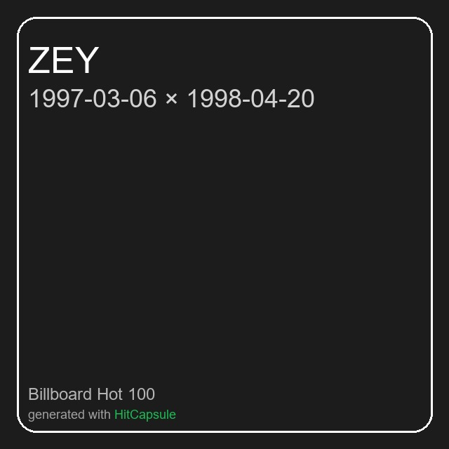

# HitCapsule — Pick a date. Press play.

Create a Spotify playlist from the **Billboard Hot 100** of any date (since 1958). Comes with a slick Streamlit UI, an optional CLI, and auto‑generated **story poster** + **playlist cover**.

<p align="center">
  <em>Pick a date → press Create My Playlist → get a hit 100‑track playlist, a shareable story poster, and an optional custom cover.</em>
</p>


## Screenshots

> Below is an example of a poster that the system creates that you can share on social media and a cover photo that will appear on the cover of your Spotify playlist.

<p align="center">
  
  &nbsp;&nbsp;&nbsp;
  
</p>

> There are system interface images and an example showing the playlist being created.

<p align="center">
  
</p>


## Features

- **Hot 100 → Spotify** for any date (1958‑08‑04 to today).  
- **Bestie Blend (two dates)**: interleave the two charts A,B,A,B… with no duplicates.  
- **Smart matching**: title & artist normalization, parentheses/variants cleanup, primary‑artist extraction, multi‑stage fallback queries, popularity‑aware scoring.  
- **Upsert playlist**: if a playlist with the same name exists, its items are **replaced** (UI).  
- **Images**: story **poster** (Top‑10 + QR) and **640×640 cover** (optional upload, extra scope).  
- **Missing report**: unseen items count and on‑screen metrics.  
- **Secrets in `.env`** (never commit credentials).

> ℹ️ Data source is Billboard’s public Hot 100 page. This tool is for personal, non‑commercial use.


## Requirements

- Python **3.10+**
- A Spotify account and a **Spotify for Developers** app
- Redirect URI (Spotify Dashboard → *Edit settings*):  
  ```
  http://127.0.0.1:8080/callback
  ```


## Setup

```bash
git clone https://github.com/yapiciemre/hitcapsule.git
cd hitcapsule

python -m venv .venv
# Windows
.venv\Scripts\activate
# macOS/Linux
source .venv/bin/activate

pip install -r requirements.txt
```

Create `.env` from the template and fill your credentials:

```bash
cp .env.example .env
```

`.env`:
```ini
SPOTIFY_CLIENT_ID=your_client_id
SPOTIFY_CLIENT_SECRET=your_client_secret
SPOTIFY_REDIRECT_URI=http://127.0.0.1:8080/callback
SPOTIFY_MARKET=US
```


## Run (UI)

```bash
streamlit run app.py
```
1. Pick a date (or enable **Bestie Blend** and pick two dates).  
2. (Optional) Enter a custom playlist name, choose “public”, and toggle “upload custom cover”.  
3. Click **Create My Playlist**.  
4. Open on Spotify, download the **poster.png**, and you’re done.

**Notes**
- If a playlist with the same name already exists, the UI **updates** it (replaces items).  
- “Upload custom cover” requires the `ugc-image-upload` scope the first time you authorize.


## Run (CLI)

```bash
cd src
python -m hitcapsule --date 1997-03-06
```
- CLI creates a new playlist named `<date> Billboard Hot 100`.  
- Bestie Blend is currently UI‑only.


## Project Structure

```
hitcapsule/
├─ .env.example
├─ app.py                     # Streamlit UI
├─ requirements.txt
├─ LICENSE
├─ README.md
└─ src/
   └─ hitcapsule/
      ├─ __init__.py
      ├─ __main__.py          # CLI entrypoint: python -m hitcapsule
      ├─ billboard.py         # Fetch Hot 100 for a given date
      ├─ spotify_client.py    # Matching, playlist upsert, cover upload
      ├─ cli.py               # CLI glue
      └─ artwork.py           # Poster & cover rendering
```


## How it works

1. **Scrape** Billboard Hot 100 for the selected date(s).  
2. **Search & score** candidates on Spotify with multiple fallback queries.  
3. **Upsert** playlist (replace items if an existing name is found).  
4. **Render** poster (Top‑10 + QR to open playlist) and an optional cover.  

**Limitations**
- Billboard page is in English; there isn’t a country‑specific Hot 100 per date here.  
- Spotify availability varies by market; set `SPOTIFY_MARKET` in `.env` if needed.


## Troubleshooting

- **Invalid redirect URI**: Dashboard and `.env` must match **exactly**.  
- **Rate‑limit (429)**: the app auto‑retries; try again in a few seconds.  
- **Nothing happens on “upload cover”**: ensure you granted the additional scope (`ugc-image-upload`).  
- **`No module named hitcapsule` (CLI)**: run from the project root and `cd src` before `python -m hitcapsule`.


## Extensible Roadmap

- Fuzzy matching (RapidFuzz) and extra heuristics for variants.  
- More poster themes & brand color customization.  
- Optional FastAPI backend + lightweight React front‑end.


## License

**MIT** — see `LICENSE`.


## Credits

- Core idea inspired by Dr. **Angela Yu**’s course project; this app was redesigned and extended from scratch.  
- Thanks to **Billboard** for the Hot 100 pages and to **Spotify**/**Spotipy** for the APIs/tools.
